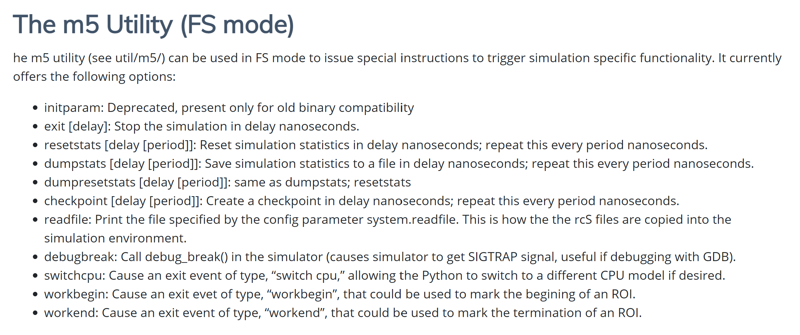
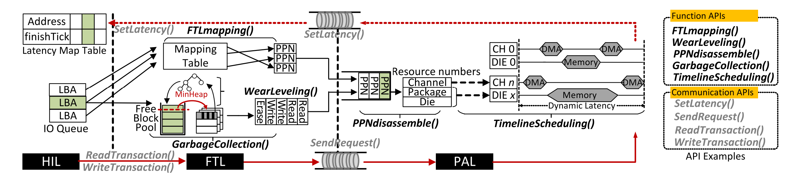
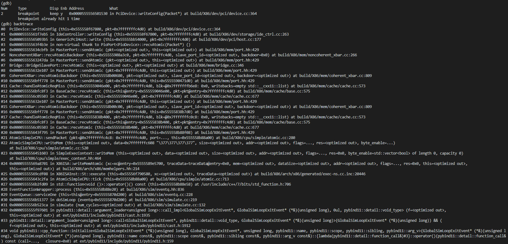
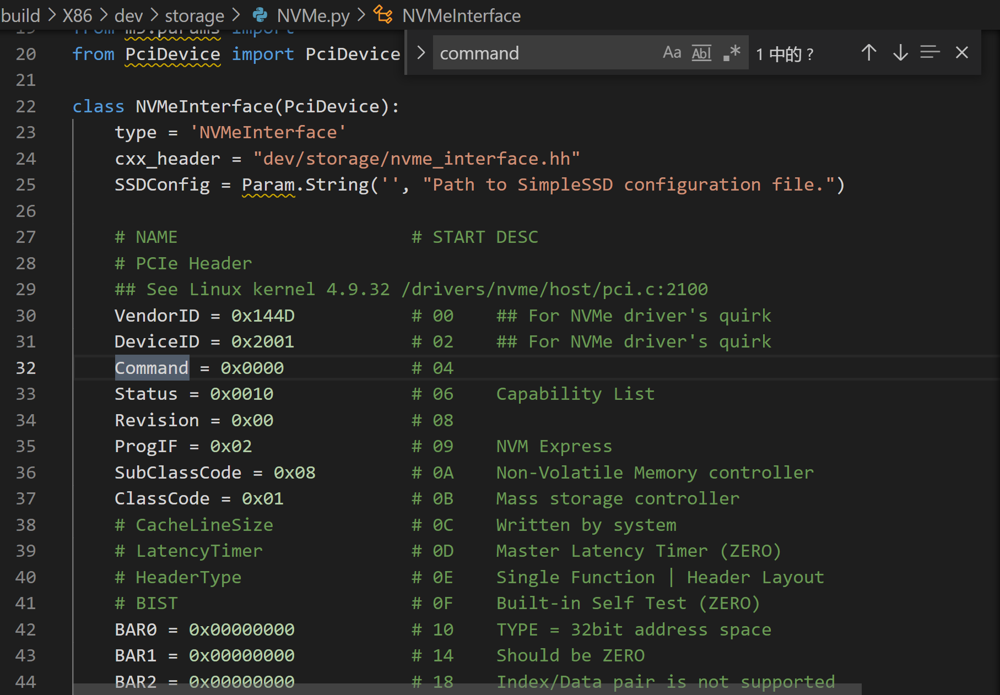
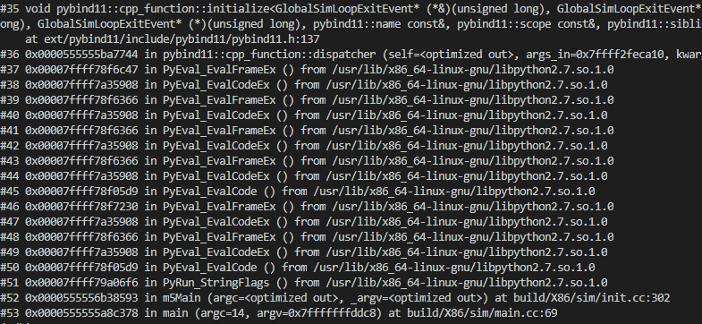

# Simplessd-Fullsystem 学习笔记
## 准备
### 若使用虚拟机 推荐vmware workstations pro 16
ubuntu 18.04 LTS
(一定不要用ubuntu20，会有bug)

#### ssh

在本地终端上创建公钥，将邮箱换成对应的个人邮箱，若选默认配置的话，则一直按Enter即可
$ ssh-keygen -t ed25519 -C "your_email@example.com"
显示并复制本地电脑公钥，并将公钥复制到SSH keys
$ cat ~/.ssh/id_ed25519.pub

#### 更换镜像源

    https://mirrors.tuna.tsinghua.edu.cn/help/ubuntu/

更新完成之后，输入：

    sudo apt update -y && sudo apt upgrade -y

以更新配置

### gem5 模块下载

Create directory to store downloaded files and set M5_PATH environment variable points that directory.

- mkdir $HOME/m5
- export M5_PATH=$HOME/m5

As we will boot gem5 in full system simulation mode, we need full system files such as Linux Kernel image and disk image. If you want to download original gem5-provided full system files, visit [gem5 download page](http://www.gem5.org/documentation/general_docs/fullsystem/guest_binaries#manual-download). **We recommend to download files from [here](https://drive.google.com/drive/folders/14b-kJmGXOhltX9Aqr8XV9i48KkZk4Lzs)**, because the files from gem5 does not support NVMe. You don’t need to download kernel_configs directory if you are not plan to build Linux Kernel on your own.

you can use winscp to transfer downloaded files to the server,and use unzip commands to unzip files:

- unzip test.zip

- 确保python版本是2.7
- apt install build-essential
- apt install scons python-dev zlib1g-dev m4 cmake
- apt install libprotobuf-dev protobuf-compiler
- apt install libgoogle-perftools-dev

## 下载
- git clone https://github.com/SimpleSSD/SimpleSSD-FullSystem.git
- cd simplessd-fullsystem
- git submodule update --init --recursive

## 编译 
for x86:

scons build/X86/gem5.opt -j 64 --ignore-style  

### 解决无法编译的问题
sudo vim /usr/bin/scons
第一行改成 路径/python2
查看路径
- which python2
安装python six 
- pip install six
安装zlib
- sudo apt install zlib1g
- sudo apt install zlib1g-dev
- sudo apt install m4
- (根据报错信息安装相应模块)

## 仿真器配置 

### gem5

### simplessd
src/dev/storage/simplessd/config/sample.cfg

## 运行

./build/X86/gem5.opt --debug-flag=M5Print --debug-file=debug.txt ./configs/example/fs.--py --kernel=x86_64-vmlinux-4.9.92 --num-cpu=4 --cpu-clock=2GHz --caches --l2cache --cpu-type=AtomicSimpleCPU --mem-size=16GB --mem-type=DDR4_2400_8x8 --ssd-interface=nvme --ssd-config=./src/dev/storage/simplessd/config/sample.cfg

./build/X86/gem5.opt --debug-flag=M5Print --debug-file=debug.txt ./configs/example/fs.py --kernel=x86_64-vmlinux-4.9.92 --num-cpu=4 --cpu-clock=2GHz --caches --l2cache --cpu-type=AtomicSimpleCPU --mem-size=4GB --mem-type=DDR4_2400_8x8 --ssd-interface=nvme --ssd-config=./src/dev/storage/simplessd/config/sample.cfg

## gem5终端
先按照下图编译

m5term localhost 3456

### 参数选择
simplessd 配置文件：
./src/dev/storage/simplessd/config/sample.cfg

## 结果分析
For SimpleSSD-FullSystem, you can find statistics at m5out/stats.txt. This stats.txt file is generated by gem5, which can controlled in user-level space through m5 utility.
## 与GEM5交互
通过SST模块：
SST (Structural Simulation Toolkit, sst-simulator.org). More
specifically, it creates a .so that wraps the libgem5_*.so library. At a
high level, this allows memory traffic to pass between the two simulators.
## 代码定位：
### ssd
src/dev/storage/simplessd
#### 模块
- hil(接口) 
- icl（缓存） 
- ftl（GC，地址映射等） 
- pal（物理介质并行管理）

##### BAR

src/dev/pci/device.hh

到SSD BAR配置为止的软件栈

- /home/nvm/huangweizhou/SimpleSSD-FullSystem/build/X86/dev/storage/NVMe.py

pci配置空间 command寄存器配置

## 程序入口：

 - m5Main (argc=<optimized out>, _argv=<optimized out>) at build/X86/sim/init.cc:302
 - main (argc=14, argv=0x7fffffffddc8) at build/X86/sim/main.cc:69

程序入口软件栈

## 线程执行逻辑
These threads start by waiting on threadBarrier.  **Once all threads have arrived at threadBarrier, they enter the simulation loop concurrently**.  When they exit the loop, they return to waiting on threadBarrier